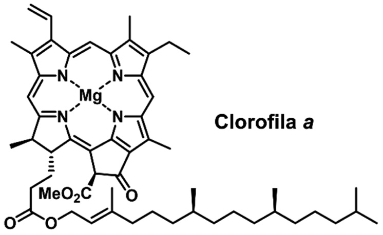

```{r setup, include=FALSE}
options(encoding = "UTF-8")
options(OutDec = ",")
options(scipen = 999, digits =5)
```

```{r, include=FALSE}
library(readxl)
library(tidyverse)
library(MASS)
library(fmsb)
library(modEvA)
library(kableExtra)
library(knitr)
library(GGally)
library(hnp)

####
library(car)
library(lmtest)

```


# Introdução 

Foi proposto um modelo linear generalizado para avaliar a produção de clorofila a em  cianobactérias em diferentes condições climáticas. O *dataset* utilizado foi obtido do catálogo de dados público do governo dos Estados Unidos, disponível em [*Data.Gov*](https://catalog.data.gov/dataset/river-cyanobacteria-datasets). Esse *datset* possui informações detalhadas sobre diferentes espécies de cianobactérias, sendo estas informações: Informações genéticas, condições climáticas do local de coleta das amostras e localização geográfica da coleta. Para a construção do modelo, foram consideradas exclusivamente as informações de clorofila a quantificada e condições ambientais (físicas e químicas) do local da coleta das amostras. O trabalho aqui desenvolvido foi fundamentado no artigo disponível no seguinte [link](https://www.nature.com/articles/s41598-023-29037-6).

## Cianobactérias 

Devido a atividade fotossintetizante das cianobactérias estima-se que as primeiras tiveram origem entre 2,6 a 3,5 bilhões de anos atrás (LAU e colab., 2015) e são uma das principais responsáveis pela atmosfera oxigenada como conhecemos hoje, participando do “Grande Evento de Oxigenação’’(HUISMAN e colab., 2018; PLANAVSKY e colab., 2014; RASMUSSEN e colab., 2008). O estromatólitos são uma evidência da atividade de microrganismos que ocorreu a , aproximadamente 3,700 milhões de anos  atrás (NUTMAN e colab., 2016).
As cianobactérias são classificadas como microrganismo procariontes autotróficos com sistemas adaptativos particulares, como a capacidade  de fixar nitrogênio do ar atmosférico devido a presença da enzima nitrogenase localizada nos heterócitos (PETERS e colab., 2015). São capazes de realizar a fotossíntese na presença ou ausência de oxigênio. Existem espécies que se desenvolvem na ausência de luz  ou em condições anaeróbicas utilizando sulfetos como doadores de elétrons para a fotossíntese, além disso são bactérias gram – negativas e dispõem da estrutura chamada bainha mucilaginosa e tricoma, podem ou não apresentar o acineto e o heterócitos  que  são estruturas especializadas na sobrevivência da espécie em ambientes não favoráveis (ABED e colab., 2009; COHEN e colab., 1986; HUISMAN e colab., 2018; LAU e colab., 2015; STAL e MOEZELAAR, 1997). 

A figura \ref{fig:fig1}, apresenta algumas das cianobactérias encontradas na região amazônica. As mesmas podem apresentar estrutura filamentosa, colonial, etc.

```{r, echo=FALSE, out.width = "80%", fig.cap="Cianobactérias-Fonte: Coleção Amazônica de Cianobactérias e Microalgas", fig.pos = 'H', fig.align = 'center', label = "fig1"}


```


A clorofila a \ref{fig:fig2} é um pigmento verde ou azul que capta a luz natural ou sintética e é essencial para a fotossíntese, é  encontrado em todos os grupos de vegetais e outros organismos
autótrofos, utilizada como indicadora da biomassa em
ambientes aquáticos.


```{r,  echo=FALSE, out.width = "60%", fig.cap="Clorofila a", fig.pos = 'H', fig.align = 'center', label = "fig2"}





```


# Resultados


Nesta seção são apresentados os resultados da análise de resíduos para o modelo 2


```{r, include=FALSE}
ciano <- read_excel("G:/Meu Drive/estatistica/mlg/glm/trab_final/ciano.xlsx")
ciano$chlorophyll_a<-as.double(ciano$chlorophyll_a)
ciano$chlorophyll_a[is.na(ciano$chlorophyll_a)]<-round(mean(ciano$chlorophyll_a, na.rm = TRUE), 2)

#Descritiva basica para o dataset

summary(ciano)

# primeiro modelo 

fit <- glm(chlorophyll_a ~ ., family = Gamma(link = "log"), data = ciano)

#fit do primeiro modelo
summary(fit)


#verificando o ajuste do modelo usando o deviance

qchisq(0.95,44)
```


```{r, include=FALSE}
#tabela com os valores do primeiro fit 

summary_fit<-summary(fit)

coef_table<-summary_fit$coefficients

coef_df<-as.data.frame(coef_table)


coef_df$Significance <- cut(coef_df[, 4], 
                            breaks = c(-Inf, 0.001, 0.01, 0.05, 0.1, Inf), 
                            labels = c("***", "**", "*", ".", ""))


```


A tabela \ref{tab:tab1}, apresenta os resultados do primeiro modelo construído. Nota-se, que apenas as variáveis  *total_nitrogen*, *pH_water* e *total_nitrogen_water...8*, foram significativas para o modelo. Por conseguinte, foi utilizado a técnica **stepwise** para escolher um novo modelo baseado no menor AIC. 

```{r echo=FALSE, label="tab1"}

kbl(coef_df, caption = "", booktabs = TRUE) |> 
  kable_styling(latex_options = c("striped","HOLD_position")) |> 
  add_footnote(c("Nota:*** p<0.001; ** p<0.01; * p<0.05; . p<0.1"))

```


Foi elaborado um novo modelo com $AIC=317$, *Residual Deviance = 28,3*. 


```{r, include=FALSE}
fit2<-glm(formula = chlorophyll_a ~ total_nitrogen + total_phosphorus + 
            dissolved_oxigen + pH_water + carbon_dioxide_water, family = Gamma(link = "log"), 
          data = ciano)
summary(fit2)

qchisq(0.95,52)

```


```{r}

#Para verificar se a função de ligação log é apropriada.
boxcox(fit2)

#Certifique-se de que todas as variáveis explicativas têm uma relação linear na escala da função de ligação (log neste caso)


#crPlots(fit2)


#bptest(fit2)


```


```{r, include=FALSE}
#tabela com os valores do primeiro fit 

summary_fit2<-summary(fit2)

coef_table2<-summary_fit2$coefficients

coef_df2<-as.data.frame(coef_table2)


coef_df2$Significance <- cut(coef_df2[, 4], 
                            breaks = c(-Inf, 0.001, 0.01, 0.05, 0.1, Inf), 
                            labels = c("***", "**", "*", ".", ""))


```


```{r echo=FALSE, label=""}

kbl(coef_df2, caption = "", booktabs = TRUE) |> 
  kable_styling(latex_options = c("striped","HOLD_position")) |> 
  add_footnote(c("Nota:*** p<0.001; ** p<0.01; * p<0.05; . p<0.1"))

```


## Análise de Resíduos


```{r}
# RESIDUAL ANALYSIS


# coeficiente de determinacao generalizado (Nagelkerke, 1991)

RsqGLM(fit2,plot=F)


# DIAGNOSTIC ANALYSIS 


# td = resid(fit2,type="deviance")
# 
# # RESIDUOS X INDICES
# 
# abline(plot(td), lty=c(2,2,3), h=c(-2,2,0))
# 
# 
# abline(plot(fitted(fit2),td) , lty=c(2,2,3), h=c(-2,2,0))


#fitted(fit2) -  aqui os valores já estão na escala original da variável resposta 

#valores estimados para o preditor linear 

#fit2$linear.predictors


```


```{r, echo=FALSE,  out.width = "80%", fig.cap="Envelope Simulado", fig.pos = 'H', fig.align = 'center', label = "envelope"}
#n1=2


#envelope simulado
set.seed(2)
hnp(fit2, halfnormal = F, how.many.out = T,  col.out = "red", main = "")


# # Alavancagem
# # alavancagem vs valores ajustados
#plot(fitted(fit3),hatvalues(fit3),ylab="Alavancagem")
# #identify(fitted(fit),hatvalues(fit), n=n1) # identifica n1 valores no grafico
# #which(hatvalues(fit2)>0.3)
# 
# # DFFIT
#plot(dffits(fit3),ylab="DFFITS")
# #identify(dffits(fit1), n=n1) # identifica n1 valores no grafico
# 
# # distancia de Cook
# # cook vs valores ajustados
#plot(fitted(fit3),cooks.distance(fit3),ylab="Distancia de Cook")
# #identify(fitted(fit1),cooks.distance(fit1), n=n1) 
# #which(cooks.distance(fit2)>0.2)

```


```{r, echo=FALSE,  out.width = "80%", fig.cap="", fig.pos = 'H', fig.align = 'center', label = "cook"}
#Grafico distancia de cook

n<-length(ciano)
k<-length(coef(fit2))


cooks_threshold<-4/(n-k)

fitted_values<-fitted(fit2)
coocks_values<-cooks.distance(fit2)


cook_data<-data.frame(Fitted = fitted_values, CookDistance = coocks_values)


ggplot(cook_data, aes(x = Fitted, y = CookDistance))+
  geom_point(aes(color = CookDistance > cooks_threshold), size = 2)+
  geom_hline(yintercept = cooks_threshold, linetype = "dashed", color = "red")+
  labs(
    title = "Gráfico de Distância de Cook",
    x = "Valores Ajustados",
    y = "Distância de Cook"
  ) +
  theme_classic()+
  theme(
    plot.title = element_text(hjust = 0.5, size = 16),
    plot.subtitle = element_text(hjust = 0.5, size = 12),
    axis.title = element_text(size = 14)
  ) +
  scale_color_manual(
    values = c("#004dff", "red"),
    labels = c("Não influente", "Influente"),
    name = "Observação"
  )

```


```{r, echo=FALSE, out.width = "80%", fig.cap="", fig.pos = 'H', fig.align = 'center', label = "residuos"}
td <- resid(fit2, type = "deviance")
fitted_values <- fitted(fit2)

# Criando um data frame para o ggplot
residuals_data <- data.frame(
  Index = seq_along(td),
  Residuals = td,
  Fitted = fitted_values
)

# Gráfico 1: Resíduos vs Índices
ggplot(residuals_data, aes(x = Index, y = Residuals)) +
  geom_point(color = "#004dff", size = 2) +
  geom_hline(yintercept = c(-2, 0, 2), linetype = c("dashed", "solid", "dashed"), color = c("red", "black", "red")) +
  labs(
    title = "Gráfico de Resíduos vs Índices",
    x = "Índices",
    y = "Resíduos Deviance"
  ) +
  theme_minimal() +
  theme(
    plot.title = element_text(hjust = 0.5, size = 16),
    axis.title = element_text(size = 14)
  )

# Gráfico 2: Resíduos vs Valores Ajustados
ggplot(residuals_data, aes(x = Fitted, y = Residuals)) +
  geom_point(color = "#004dff", size = 2) +
  geom_hline(yintercept = c(-2, 0, 2), linetype = c("dashed", "solid", "dashed"), color = c("red", "black", "red")) +
  labs(
    title = "Gráfico de Resíduos vs Valores Ajustados",
    x = "Valores Ajustados",
    y = "Resíduos Deviance"
  ) +
  theme_minimal() +
  theme(
    plot.title = element_text(hjust = 0.5, size = 16),
    axis.title = element_text(size = 14)
  )
```


